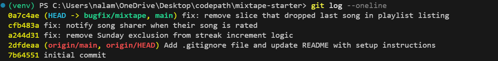

# Mixtape Bug Hunt — Submission

## AI Usage

I used Claude throughout this project for codebase orientation and debugging assistance.

For orientation, I pasted the contents of each service file and asked Claude to explain what each function does and what it returns. This helped me build a mental model of the app faster than reading cold, especially for understanding how notification_service.py handles two different "friend interacted with your song" flows differently.

For Issue 1, I had already narrowed the bug to update_listening_streak before asking Claude anything. I asked it to explain what Python's datetime.weekday() returns for each day of the week, which confirmed that weekday() == 6 is Sunday, and that the condition today.weekday() != 6 was specifically excluding Sundays from the increment branch. I verified this myself by constructing a fake Sunday datetime in flask shell and watching the streak reset to 1 instead of incrementing.

For Issue 3, Claude initially flagged the outerjoin in search_songs as a likely duplicate source. I ran the reproduction steps and the bug did not manifest in my version of SQLAlchemy, which deduplicates Song objects automatically when querying by model. I had to override Claude's initial read here and switch to Issue 4 instead, which I confirmed did reproduce.

For Issues 4 and 5, Claude helped me identify the suspicious lines after I had already read the relevant functions. I ran flask shell tests myself to confirm the broken behavior before making any changes.

---

## Codebase Map

### Main files and their roles

`app.py` is the Flask application factory. It initializes the database, registers four blueprints (songs, playlists, users, feed), and creates all tables on startup. You never run this file directly.

`models.py` defines seven SQLAlchemy models: User, Tag, Song, ListeningEvent, Rating, Playlist, and Notification. It also defines three association tables. The friendships table is a symmetric many-to-many on User. The song_tags table links Songs to Tags. The playlist_entries table links Songs to Playlists and adds position, added_by, and added_at columns, so playlist song order is explicit rather than insertion order.

`routes/songs.py` handles song search, individual song lookup, rating a song, and recording a listen event. Every route parses the request and immediately calls a service function.

`routes/playlists.py` handles playlist creation, fetching playlist metadata, fetching playlist songs, and adding a song to a playlist.

`routes/users.py` handles user profile lookup, streak retrieval, notification listing, and marking a notification as read.

`routes/feed.py` handles two feed endpoints: friends listening now (last 24 hours, deduplicated per friend) and general activity feed (most recent N events from all friends).

`services/streak_service.py` records listening events and updates a user's consecutive-day listening streak based on the difference between today's date and the last date they listened.

`services/feed_service.py` queries ListeningEvent records for a user's friends and formats them into feed responses.

`services/search_service.py` queries Song records by title or artist using a case-insensitive LIKE match and returns results with their associated tags.

`services/notification_service.py` creates Notification records and handles the two main notification-triggering flows: adding a song to a playlist and rating a song. It also handles retrieving and marking notifications.

`services/playlist_service.py` handles playlist creation, metadata retrieval, and ordered song retrieval using the position column in playlist_entries.

### Architectural pattern

Every route delegates immediately to a service function. Routes only handle request parsing and response formatting. All business logic lives in services.

### Data flow: song added to playlist triggers a notification

A user sends POST /playlists/<id>/songs with a song_id and added_by field. The route calls notification_service.add_to_playlist(). That function loads the Song, User, and Playlist from the database, appends the song to the playlist if it is not already there, commits, then checks whether song.shared_by matches added_by_user_id. If they are different users, it calls create_notification() with the sharer's user_id, a type of song_added_to_playlist, and a human-readable body string.

---

## Bug Fixes

### Issue 1: My listening streak keeps resetting

**How I reproduced it**

In flask shell, I set a user's last_listened_at to a Saturday (the day before a known Sunday) and set their listening_streak to 5. I then called update_listening_streak with a datetime set to Sunday July 5, 2026. The streak reset to 1 instead of incrementing to 6. I confirmed fake_sunday.weekday() returned 6 before running the test so I knew the Sunday branch was actually being hit.

**How I found the root cause**

I read streak_service.py top to bottom and focused on update_listening_streak. The function has three branches based on days_since_last: 0 means no change, 1 means increment, anything else means reset. The increment branch had an extra condition attached: today.weekday() != 6. I looked up what weekday() returns for Sunday and confirmed it is 6, which means that condition evaluates to False every Sunday, pushing execution into the else branch and resetting the streak.

**The root cause**

The condition for incrementing the streak was days_since_last == 1 and today.weekday() != 6. Python's datetime.weekday() returns 6 for Sunday. This meant any user who listened on consecutive days where the second day was a Sunday had their streak reset to 1 instead of incremented, because the Sunday check forced the code into the reset branch regardless of the days_since_last value.

**My fix and side-effect check**

I removed the and today.weekday() != 6 condition entirely, leaving elif days_since_last == 1: with no day-of-week restriction. There is no legitimate reason consecutive-day behavior should differ on Sundays. After the fix I re-ran the same reproduction test and the streak correctly incremented to 6. I also manually confirmed that days_since_last == 0 (same day, no change) and days_since_last > 1 (skipped day, reset) still behaved correctly since those branches were not touched.

---

### Issue 4: No notification when a friend rates my song

**How I reproduced it**

In flask shell, I picked two seeded users where one had shared a song. I called rate_song with the other user's id, the song id, and a score of 5. Then I called get_notifications for the sharer and got an empty list back. The rating was saved correctly but no notification was created.

**How I found the root cause**

I compared rate_song and add_to_playlist side by side in notification_service.py. add_to_playlist creates a notification for the song sharer after saving the playlist change. rate_song saves the rating and returns it with no notification call at all. The pattern for notifying the sharer exists and works correctly in add_to_playlist but was never implemented in rate_song.

**The root cause**

rate_song in notification_service.py handles the rating logic correctly but never calls create_notification. The add_to_playlist function in the same file shows the correct pattern: check if song.shared_by != the acting user, then call create_notification with the sharer's id, a type string, and a body. That pattern was simply missing from rate_song entirely.

**My fix and side-effect check**

I added a notification block at the end of rate_song, before the return statement, that checks if song.shared_by != user_id and calls create_notification with type song_rated and a body string naming the rater, the song title, and the score. After the fix I re-ran the reproduction test and got 1 notification back with the correct type, body, and recipient. I also confirmed that rating your own song does not trigger a notification since the shared_by check guards against self-notification, matching the same behavior already in add_to_playlist.

---

### Issue 5: The last song in a playlist never shows up

**How I reproduced it**

In flask shell, I called get_playlist_songs on all three seeded playlists and compared the returned count to len(playlist.songs) for each. Every playlist returned one fewer song than it actually contained. All three showed 6 returned vs 7 in the database.

**How I found the root cause**

I read get_playlist_songs in playlist_service.py. The query itself is correct: it joins playlist_entries, filters by playlist_id, and orders by position ascending. The bug was on the return line: songs[:-1]. In Python, [:-1] slices off the last element of a list. The query returns all songs in the correct order and then the return statement drops the final one before sending it back.

**The root cause**

The return statement in get_playlist_songs was return [song.to_dict() for song in songs[:-1]]. The [:-1] slice removes the last element from the correctly ordered song list before it is returned. This meant every playlist was always missing its final song regardless of playlist size or content.

**My fix and side-effect check**

I changed songs[:-1] to songs, so the full list is returned. After the fix all three playlists correctly returned 7 songs matching their actual contents. I also checked the edge case of a single-song playlist: before the fix it would have returned an empty list, after the fix it correctly returns the one song. The query logic, ordering, and filtering were all untouched.

---

## Git Log Screenshot

